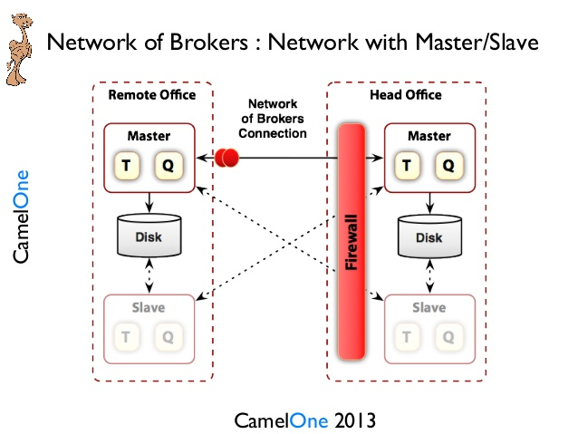

# Commands :
```
Abhijeets-MacBook-Pro:Master-Slave javabrain$ pwd
/Users/javabrain/Documents/apps/Master-Slave
Abhijeets-MacBook-Pro:Master-Slave javabrain$ ./amq-5.8.0/cluster/broker1/bin/broker 1
INFO: Using default configuration
(you can configure options in one of these file: /etc/default/activemq /Users/javabrain/.activemqrc)

INFO: Invoke the following command to create a configuration file
/Users/javabrain/Documents/apps/Master-Slave/amq-5.8.0/bin/activemq setup [ /etc/default/activemq | /Users/javabrain/.activemqrc ]

INFO: Using java '/Library/Java/JavaVirtualMachines/jdk1.8.0_181.jdk/Contents/Home/bin/java'
INFO: Starting - inspect logfiles specified in logging.properties and log4j.properties to get details
INFO: pidfile created : '/Users/javabrain/Documents/apps/Master-Slave/sharedData-1/activemq-broker-1.pid' (pid '995')
Abhijeets-MacBook-Pro:Master-Slave javabrain$ ./amq-5.8.0/cluster/broker2/bin/broker 1
INFO: Using default configuration
(you can configure options in one of these file: /etc/default/activemq /Users/javabrain/.activemqrc)

INFO: Invoke the following command to create a configuration file
/Users/javabrain/Documents/apps/Master-Slave/amq-5.8.0/bin/activemq setup [ /etc/default/activemq | /Users/javabrain/.activemqrc ]

INFO: Using java '/Library/Java/JavaVirtualMachines/jdk1.8.0_181.jdk/Contents/Home/bin/java'
INFO: Starting - inspect logfiles specified in logging.properties and log4j.properties to get details
INFO: pidfile created : '/Users/javabrain/Documents/apps/Master-Slave/sharedData-2/activemq-broker-1.pid' (pid '1015')
Abhijeets-MacBook-Pro:Master-Slave javabrain$ 
```


# Total process running :
```
Abhijeets-MacBook-Pro:Master-Slave javabrain$ ps -ef | grep activemq
  502   995     1   0  9:57PM ttys000    0:11.87 /Library/Java/JavaVirtualMachines/jdk1.8.0_181.jdk/Contents/Home/bin/java -Xms1G -Xmx1G -Djava.util.logging.config.file=logging.properties -Dcom.sun.management.jmxremote -Djava.io.tmpdir=/Users/javabrain/Documents/apps/Master-Slave/amq-5.8.0/cluster/broker1/tmp -Dactivemq.classpath=/Users/javabrain/Documents/apps/Master-Slave/amq-5.8.0/cluster/broker1/conf; -Dactivemq.home=/Users/javabrain/Documents/apps/Master-Slave/amq-5.8.0 -Dactivemq.base=/Users/javabrain/Documents/apps/Master-Slave/amq-5.8.0/cluster/broker1 -Dactivemq.conf=/Users/javabrain/Documents/apps/Master-Slave/amq-5.8.0/cluster/broker1/conf -Dactivemq.data=/Users/javabrain/Documents/apps/Master-Slave/sharedData-1 -Dactivemq.logFile=broker-1 -jar /Users/javabrain/Documents/apps/Master-Slave/amq-5.8.0/bin/activemq.jar start
  502  1015     1   0  9:57PM ttys000    0:10.94 /Library/Java/JavaVirtualMachines/jdk1.8.0_181.jdk/Contents/Home/bin/java -Xms1G -Xmx1G -Djava.util.logging.config.file=logging.properties -Dcom.sun.management.jmxremote -Djava.io.tmpdir=/Users/javabrain/Documents/apps/Master-Slave/amq-5.8.0/cluster/broker2/tmp -Dactivemq.classpath=/Users/javabrain/Documents/apps/Master-Slave/amq-5.8.0/cluster/broker2/conf; -Dactivemq.home=/Users/javabrain/Documents/apps/Master-Slave/amq-5.8.0 -Dactivemq.base=/Users/javabrain/Documents/apps/Master-Slave/amq-5.8.0/cluster/broker2 -Dactivemq.conf=/Users/javabrain/Documents/apps/Master-Slave/amq-5.8.0/cluster/broker2/conf -Dactivemq.data=/Users/javabrain/Documents/apps/Master-Slave/sharedData-2 -Dactivemq.logFile=broker-1 -jar /Users/javabrain/Documents/apps/Master-Slave/amq-5.8.0/bin/activemq.jar start
  502  1054   600   0 10:05PM ttys000    0:00.00 grep activemq
Abhijeets-MacBook-Pro:Master-Slave javabrain$ 
```

# Scheduling Slave :
```
Abhijeets-MacBook-Pro:Master-Slave javabrain$ ./amq-5.8.0/cluster/broker2/bin/broker 2
INFO: Using default configuration
(you can configure options in one of these file: /etc/default/activemq /Users/javabrain/.activemqrc)

INFO: Invoke the following command to create a configuration file
/Users/javabrain/Documents/apps/Master-Slave/amq-5.8.0/bin/activemq setup [ /etc/default/activemq | /Users/javabrain/.activemqrc ]

INFO: Using java '/Library/Java/JavaVirtualMachines/jdk1.8.0_181.jdk/Contents/Home/bin/java'
INFO: Starting - inspect logfiles specified in logging.properties and log4j.properties to get details
INFO: pidfile created : '/Users/javabrain/Documents/apps/Master-Slave/sharedData-2/activemq-broker-2.pid' (pid '1076')
Abhijeets-MacBook-Pro:Master-Slave javabrain$ 
```
# Slave log :
```
2020-01-27 22:08:48,251 | INFO  | Database /Users/javabrain/Documents/apps/Master-Slave/sharedData-2/kahadb/lock is locked... waiting 10 seconds for the database to be unlocked. Reason: java.io.IOException: File '/Users/javabrain/Documents/apps/Master-Slave/sharedData-2/kahadb/lock' could not be locked. | org.apache.activemq.store.SharedFileLocker | main
2020-01-27 22:08:58,257 | INFO  | Database /Users/javabrain/Documents/apps/Master-Slave/sharedData-2/kahadb/lock is locked... waiting 10 seconds for the database to be unlocked. Reason: java.io.IOException: File '/Users/javabrain/Documents/apps/Master-Slave/sharedData-2/kahadb/lock' could not be locked. | org.apache.activemq.store.SharedFileLocker | main
2020-01-27 22:09:08,259 | INFO  | Database /Users/javabrain/Documents/apps/Master-Slave/sharedData-2/kahadb/lock is locked... waiting 10 seconds for the database to be unlocked. Reason: java.io.IOException: File '/Users/javabrain/Documents/apps/Master-Slave/sharedData-2/kahadb/lock' could not be locked. | org.apache.activemq.store.SharedFileLocker | main
2020-01-27 22:09:18,265 | INFO  | Database /Users/javabrain/Documents/apps/Master-Slave/sharedData-2/kahadb/lock is locked... waiting 10 seconds for the database to be unlocked. Reason: java.io.IOException: File '/Users/javabrain/Documents/apps/Master-Slave/sharedData-2/kahadb/lock' could not be locked. | org.apache.activemq.store.SharedFileLocker | main

```

